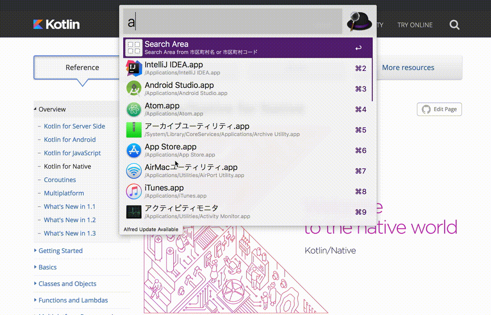

# alfred-city
Alfred workflow made by Kotlin Native



## environment
- Gradle Wrapper:4.7
- kotlin-native-gradle-plugin:1.3.11
- kotlinx-serialization-runtime-native:0.9.0

## build

````sh
$ ./gradlew build
````

kexe path

- /build/exe/main/release/alfred-city.kexe

## run example

```sh
./build/exe/main/release/alfred-city.kexe 13 workflow/are.json
```

## workflow

Download [here](https://github.com/sakebook/alfred-city/releases/tag/0.0.1)